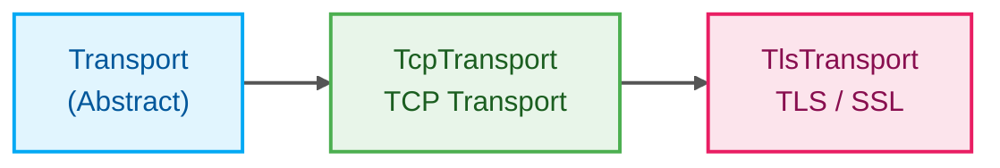

# Transport

A general-purpose transport abstraction library designed for ESP-IDF v6.0.2. It provides clean, object-oriented wrappers for plain TCP and secure TLS connections.

---

# What is it?

**Transport** is a lightweight C++ library that simplifies network communication for embedded applications by providing a common interface for different transport mechanisms.

### The Problem It Solves

Embedded applications frequently need to communicate over different network transports such as TCP and TLS. Without a common abstraction, applications become tightly coupled to the underlying transport implementation, making future changes difficult.

### How It Works

The library provides an abstract `Transport` interface that defines a common communication contract. Concrete implementations such as `TcpTransport` and `TlsTransport` implement this interface using the ESP-IDF transport APIs, allowing applications to switch between plain TCP and secure TLS without modifying their networking logic.

### Intended Audience

Embedded developers building network-enabled applications using ESP-IDF and C++.

---

# Quick Start

## Prerequisites

* ESP-IDF v6.0.2
* C++ compiler supported by ESP-IDF
* Network connectivity (Wi-Fi or Ethernet)

## Installation

1. Copy the `Transport` component into your project's `components/` directory.

2. Register the component dependencies in the component `CMakeLists.txt`.

```cmake
idf_component_register(
    SRC_DIRS "src"
    INCLUDE_DIRS "include"
    REQUIRES tcp_transport log esp-tls
)
```

---

# Basic Usage

The following example demonstrates establishing a secure TLS connection.

```cpp
#include "TlsTransport.hpp"

#include <cstring>

void network_task()
{
    // Create the transport object
    TlsTransport secureSocket;

    // Load the PEM certificate from your file system
    const char* certPem = read_cert_from_file("/spiffs/ca.pem");

    secureSocket.SetCert(certPem);

    if (!secureSocket.Initialise())
    {
        return;
    }

    if (secureSocket.Connect("api.example.com", 443, 5000))
    {
        const char* request =
            "GET / HTTP/1.1\r\n"
            "Host: api.example.com\r\n"
            "Connection: close\r\n"
            "\r\n";

        secureSocket.Write(
            reinterpret_cast<const uint8_t*>(request),
            std::strlen(request),
            2000);

        secureSocket.Disconnect();
    }

    secureSocket.Destroy();
}
```

---

# API Overview

| API            | Description                                                           |
| -------------- | --------------------------------------------------------------------- |
| `Transport`    | Abstract base class defining the common transport interface.          |
| `TcpTransport` | Implements plain TCP communication using the ESP-IDF transport layer. |
| `TlsTransport` | Extends `TcpTransport` to provide TLS-secured communication.          |
| `Initialise()` | Initializes the underlying transport handle.                          |
| `Destroy()`    | Releases the allocated transport resources.                           |
| `SetCert()`    | Sets the PEM certificate used for TLS verification.                   |
| `Connect()`    | Connects to a remote host.                                            |
| `Read()`       | Reads incoming bytes with a configurable timeout.                     |
| `Write()`      | Sends data with a configurable timeout.                               |
| `Disconnect()` | Closes the active connection while preserving the transport object.   |

---

# Architecture

The Transport library follows a simple inheritance-based architecture.



* **Transport** defines the common interface for all transport implementations.
* **TcpTransport** implements plain TCP communication using the ESP-IDF transport APIs.
* **TlsTransport** extends `TcpTransport` by replacing the underlying transport with a TLS-enabled implementation and adding certificate management.

This architecture allows applications to work with a common interface while easily switching between unencrypted and encrypted communication.

---

# Documentation

Additional documentation is available in the `docs` directory.

* [Architecture Guide](docs/architecture.md)
* [API Reference](docs/api.md)
* [Configuration Guide](docs/configuration.md)
* [Examples](docs/examples.md)
* [Troubleshooting](docs/troubleshooting.md)
* [AI Context](docs/ai-context.md)

---

# License

This project is licensed under the **MIT License**.
